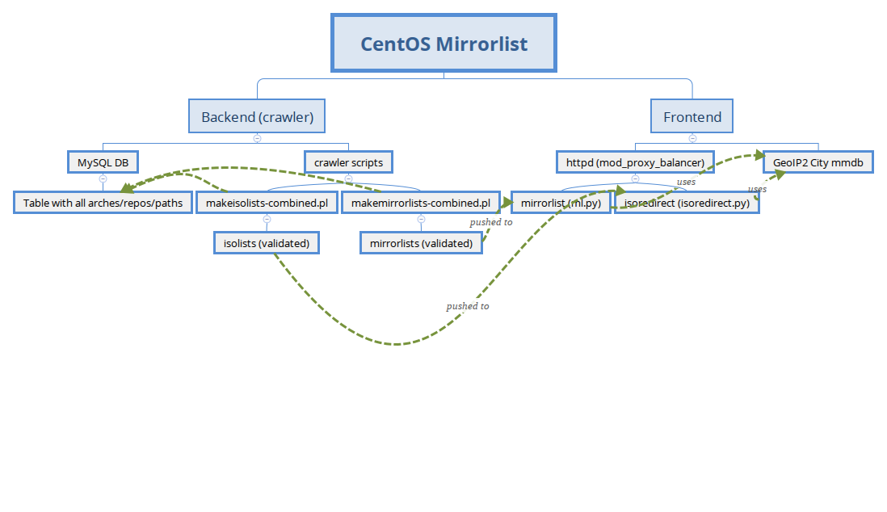

This git repository contains the various scripts used in the CentOS Infra for mirrorlist service and isoredirect service.

## Overview 

It contains the following kind of scripts:

 * backend : so scripts used by our "crawler" node, validating in loop all the external mirrors through IPv4 and IPv6 and so producing the 'mirrorlists', each one per repo/arch/country
 * frontend : python scripts used for :

   * http://mirrorlist.centos.org
   * http://isoredirect.centos.org

## Backend (crawler)
There are two Perl scripts for checking mirrors: 

 * makemirrorlists-combined.pl for creating files for mirrorlist.centos.org
 * makeisolists-combined.pl for creating files for isoredirect.centos.org. 

Both scripts can create lists for CentOS 6 and CentOS 7,including SIG and AltArch content. makemirrorlists-combined.pl will test each mirror separately for IPv4 and IPv6.

mirrorlist.centos.org will then be able to present only IPv6-capable mirrors to the clients when mirrorlist.centos.org is accessed over IPv6.
More details about the internals of these scripts can be found in backend/mirrorlist_crawler_deployment_notes.txt

## Frontend 
All scripts are located in the frontend folder.
The following items are needed for the mirrorlist/isoredirect service:

 * A http server (apache) using mod_proxy_balancer (see frontend/httpd/mirrorlist.conf vhost example)
 * python-bottle to run the {ml,isoredirect}.py code for various instances
 * Maxmind Geolite2 database : [City version](https://dev.maxmind.com/geoip/geoip2/geolite2/)
 * python-geoip2 pkg (to consume those Geolite2 DB)
 * For each worker, a specific instance/port can be initialized and added to Apache config for the proxy-balancer (see frontend/systemd/centos-ml-worker@.service)

Those services (mirrorlist/isoredirect) just consume mirrorlist files, pushed to those nodes, and updated in loop by the Crawler process (see Backend section above)

When a request is made to the service, the python script :
 
 * checks for IPv4 or IPv6 connectivity
 * computes Geolocation based on the origin IP
 * searches for validated mirrors in the same country/state for the request arch/repo/release
 * returns such list
